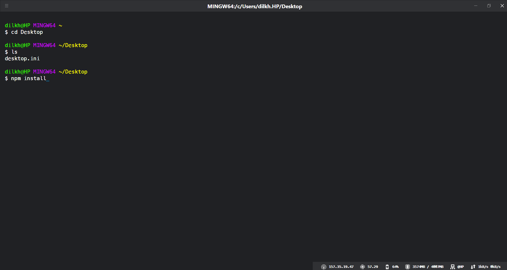

# Hyper Terminal config

1. [Config 1](./config1.js)
  
To get status line at bottom that shows you useful system information such as free memory, uptime and CPU usage. Install HyperLine plugin using - **`npm i hyperline`**

--- 

How to add config to your Hyper Terminal -  
   
   - Copy config code
   - Open Hyper  
   - Open preferences by ctrl + comma and paste config code.
   - Save and close.

---